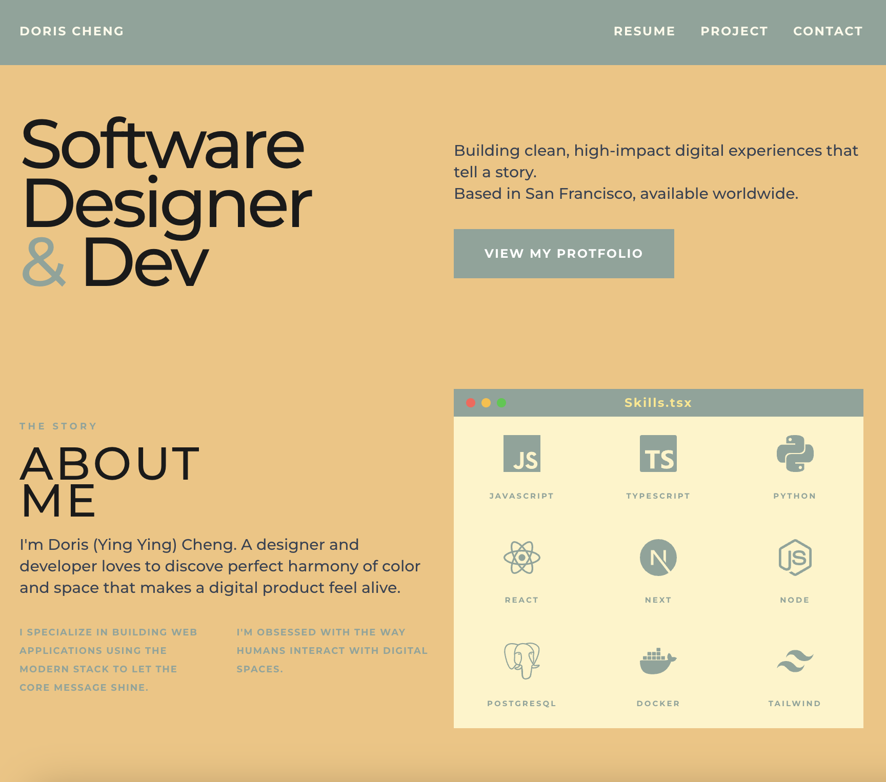

# My Portfolio

A personal portfolio website built with Next.js, React, and Tailwind CSS.

## Demo

🔗 [Live Site](https://dorischeng.vercel.app/)

## Tech Stack

- **Framework:** Next.js 16 (App Router)
- **UI:** React 19, Tailwind CSS 4
- **Animations:** Matter.js (physics engine)
- **Icons:** React Icons
- **Language:** TypeScript

## Getting Started

### Prerequisites

- Node.js 18+
- npm (or yarn/pnpm)

### Installation

git clone https://github.com/your-username/my-portfolio.git
cd my-portfolio
npm install
npm run dev

Open http://localhost:3000 to view it.

## Project Structure

├── app/ # Pages, layout, and global styles
├── components/ # Reusable UI components
├── public/ # Static assets (images, resume, favicons)
└── ... # Config files (Next.js, TypeScript, ESLint, etc.)

## Deployment

Deployed on [Vercel](https://vercel.com). Push to `main` to trigger automatic deployment.

## License

MIT
