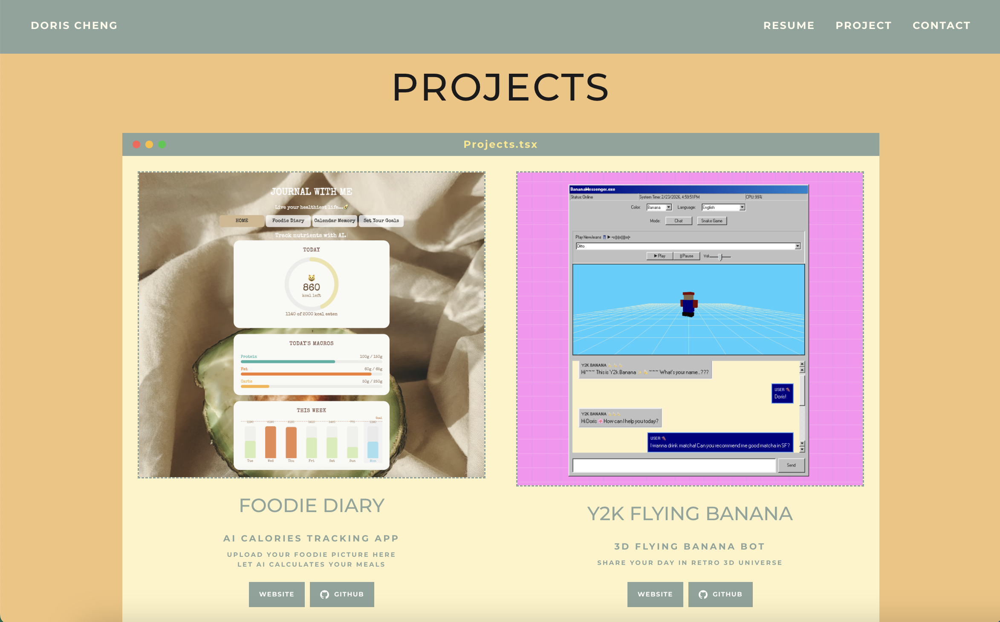

# My Portfolio

A personal portfolio website built with Next.js, React, and Tailwind CSS.

## Demo : 🔗 [My Portfolio - Hey 🩷 It's Doris Cheng 🩶 🩵](https://dorischeng.vercel.app/)




## Tech Stack

- **Framework:** Next.js 16 (App Router)
- **UI:** React 19, Tailwind CSS 4
- **Icons:** React Icons
- **Language:** TypeScript

## Getting Started

### Prerequisites

- Node.js 18+
- npm (or yarn/pnpm)

### Installation

```bash
git clone https://github.com/Yingyingcheng/my-portfolio
cd my-portfolio
npm install
npm run dev
```

Open `http://localhost:3000` to view it.

## Project Structure

```
├── app/          # Pages, layout, and global styles
├── components/   # Reusable UI components
├── public/       # Static assets (images, resume, favicons)
└── ...           # Config files (Next.js, TypeScript, ESLint, etc.)
```

## Deployment

Deployed on [Vercel](https://vercel.com). Push to `main` to trigger automatic deployment.

## License

MIT
